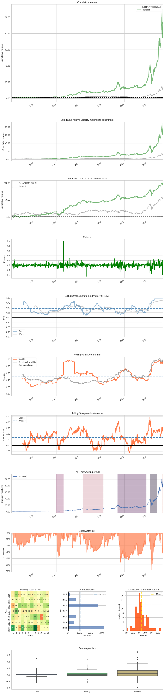
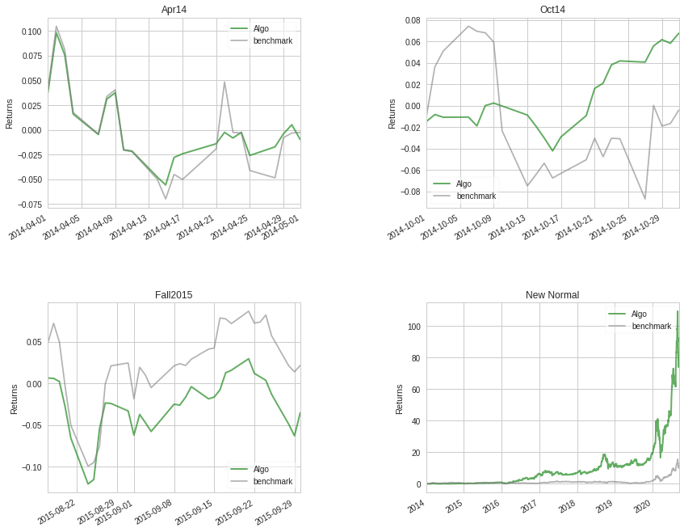
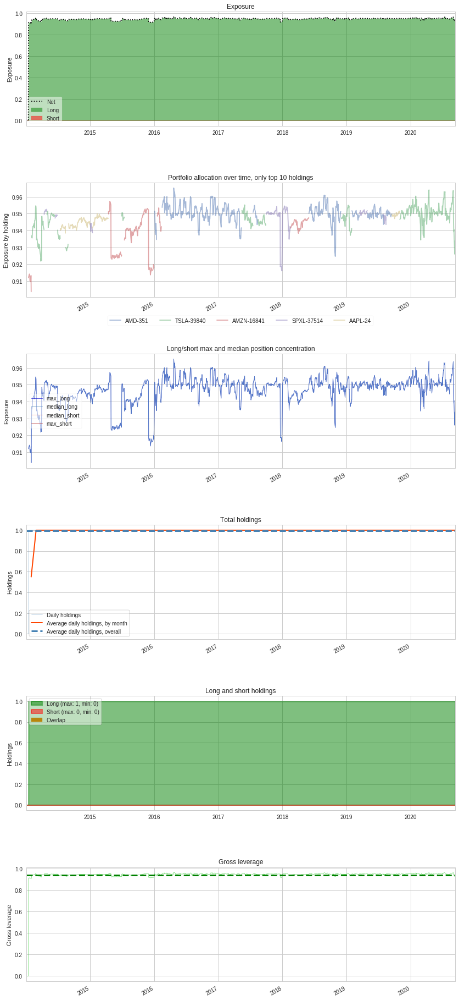
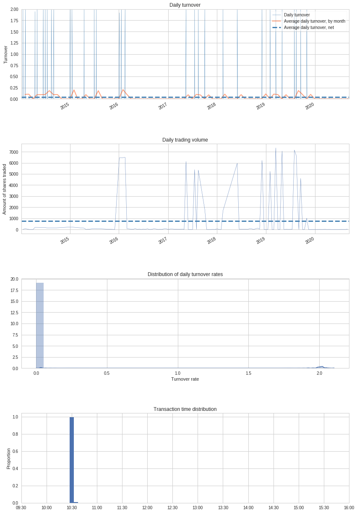
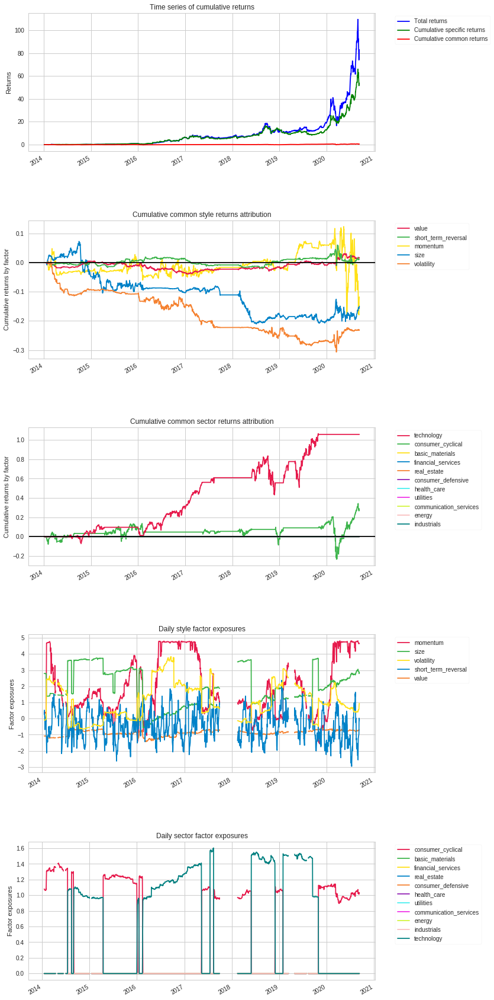

# Dual-Momentum-Trading-Bot-Results

## What is this repository?
A trading bot utilized on the TD Ameritrade platform written in python and utilizing [tda-api](https://tda-api.readthedocs.io/en/latest/index.html) API. Bot originally discovered, tweaked, and backtested on [Quantopian](https://www.quantopian.com/home). 

## What strategy is used?
We utilized [Dual Momentum Strategy](https://engineeredportfolio.com/2018/05/02/accelerating-dual-momentum-investing/) which focuses on weighted momentum based on the previous 1, 3, and 6 months. Portfolio rebalance happens bi-monthly. Risk lies in having entire portfolio within one stock and huge drawdown. However, since we would have held long term without rebalance, we would have expected similar drawdowns. 

## Why we chose the stocks we used?
Since our plan is to hold stocks we find value in long term, we decided to implement a momentum based strategy that would alternate between stocks that we would have held long term regardless. 


<table border="1" class="dataframe">
  <thead>
    <tr style="text-align: right;"><th>Start date</th><td colspan=2>2014-01-03</td></tr>
    <tr style="text-align: right;"><th>End date</th><td colspan=2>2020-09-11</td></tr>
    <tr style="text-align: right;"><th>Total months</th><td colspan=2>80</td></tr>
    <tr style="text-align: right;">
      <th></th>
      <th>Backtest</th>
    </tr>
  </thead>
  <tbody>
    <tr>
      <th>Annual return</th>
      <td>93.96%</td>
    </tr>
    <tr>
      <th>Cumulative returns</th>
      <td>8290.412%</td>
    </tr>
    <tr>
      <th>Annual volatility</th>
      <td>57.039%</td>
    </tr>
    <tr>
      <th>Sharpe ratio</th>
      <td>1.44</td>
    </tr>
    <tr>
      <th>Calmar ratio</th>
      <td>1.61</td>
    </tr>
    <tr>
      <th>Stability</th>
      <td>0.94</td>
    </tr>
    <tr>
      <th>Max drawdown</th>
      <td>-58.344%</td>
    </tr>
    <tr>
      <th>Omega ratio</th>
      <td>1.34</td>
    </tr>
    <tr>
      <th>Sortino ratio</th>
      <td>2.31</td>
    </tr>
    <tr>
      <th>Skew</th>
      <td>1.49</td>
    </tr>
    <tr>
      <th>Kurtosis</th>
      <td>26.22</td>
    </tr>
    <tr>
      <th>Tail ratio</th>
      <td>1.27</td>
    </tr>
    <tr>
      <th>Daily value at risk</th>
      <td>-6.86%</td>
    </tr>
    <tr>
      <th>Gross leverage</th>
      <td>0.94</td>
    </tr>
    <tr>
      <th>Daily turnover</th>
      <td>3.74%</td>
    </tr>
    <tr>
      <th>Alpha</th>
      <td>0.67</td>
    </tr>
    <tr>
      <th>Beta</th>
      <td>0.60</td>
    </tr>
  </tbody>
</table>


<table border="1" class="dataframe">
  <thead>
    <tr style="text-align: right;">
      <th>Worst drawdown periods</th>
      <th>Net drawdown in %</th>
      <th>Peak date</th>
      <th>Valley date</th>
      <th>Recovery date</th>
      <th>Duration</th>
    </tr>
  </thead>
  <tbody>
    <tr>
      <th>0</th>
      <td>58.34</td>
      <td>2020-02-19</td>
      <td>2020-03-18</td>
      <td>2020-06-08</td>
      <td>79</td>
    </tr>
    <tr>
      <th>1</th>
      <td>46.41</td>
      <td>2018-09-14</td>
      <td>2018-10-29</td>
      <td>2019-12-23</td>
      <td>332</td>
    </tr>
    <tr>
      <th>2</th>
      <td>39.84</td>
      <td>2015-12-29</td>
      <td>2016-02-09</td>
      <td>2016-04-22</td>
      <td>84</td>
    </tr>
    <tr>
      <th>3</th>
      <td>32.36</td>
      <td>2017-02-27</td>
      <td>2017-05-08</td>
      <td>2018-01-26</td>
      <td>240</td>
    </tr>
    <tr>
      <th>4</th>
      <td>32.10</td>
      <td>2020-08-31</td>
      <td>2020-09-08</td>
      <td>NaT</td>
      <td>NaN</td>
    </tr>
  </tbody>
</table>


<table border="1" class="dataframe">
  <thead>
    <tr style="text-align: right;">
      <th>Stress Events</th>
      <th>mean</th>
      <th>min</th>
      <th>max</th>
    </tr>
  </thead>
  <tbody>
    <tr>
      <th>Apr14</th>
      <td>-0.01%</td>
      <td>-5.57%</td>
      <td>5.81%</td>
    </tr>
    <tr>
      <th>Oct14</th>
      <td>0.29%</td>
      <td>-1.46%</td>
      <td>2.56%</td>
    </tr>
    <tr>
      <th>Fall2015</th>
      <td>-0.08%</td>
      <td>-5.89%</td>
      <td>6.89%</td>
    </tr>
    <tr>
      <th>New Normal</th>
      <td>0.33%</td>
      <td>-23.15%</td>
      <td>50.11%</td>
    </tr>
  </tbody>
</table>


<table border="1" class="dataframe">
  <thead>
    <tr style="text-align: right;">
      <th>Top 10 long positions of all time</th>
      <th>max</th>
    </tr>
  </thead>
  <tbody>
    <tr>
      <th>AMD-351</th>
      <td>96.52%</td>
    </tr>
    <tr>
      <th>TSLA-39840</th>
      <td>96.41%</td>
    </tr>
    <tr>
      <th>AMZN-16841</th>
      <td>95.73%</td>
    </tr>
    <tr>
      <th>SPXL-37514</th>
      <td>95.46%</td>
    </tr>
    <tr>
      <th>AAPL-24</th>
      <td>95.15%</td>
    </tr>
  </tbody>
</table>


<table border="1" class="dataframe">
  <thead>
    <tr style="text-align: right;">
      <th>Top 10 short positions of all time</th>
      <th>max</th>
    </tr>
  </thead>
  <tbody>
  </tbody>
</table>


<table border="1" class="dataframe">
  <thead>
    <tr style="text-align: right;">
      <th>Top 10 positions of all time</th>
      <th>max</th>
    </tr>
  </thead>
  <tbody>
    <tr>
      <th>AMD-351</th>
      <td>96.52%</td>
    </tr>
    <tr>
      <th>TSLA-39840</th>
      <td>96.41%</td>
    </tr>
    <tr>
      <th>AMZN-16841</th>
      <td>95.73%</td>
    </tr>
    <tr>
      <th>SPXL-37514</th>
      <td>95.46%</td>
    </tr>
    <tr>
      <th>AAPL-24</th>
      <td>95.15%</td>
    </tr>
  </tbody>
</table>


## Performance Relative to Common Risk Factors


<table border="1" class="dataframe">
  <thead>
    <tr style="text-align: right;">
      <th>Summary Statistics</th>
      <th></th>
    </tr>
  </thead>
  <tbody>
    <tr>
      <th>Annualized Specific Return</th>
      <td>81.75%</td>
    </tr>
    <tr>
      <th>Annualized Common Return</th>
      <td>6.45%</td>
    </tr>
    <tr>
      <th>Annualized Total Return</th>
      <td>93.96%</td>
    </tr>
    <tr>
      <th>Specific Sharpe Ratio</th>
      <td>1.43</td>
    </tr>
  </tbody>
</table>


<table border="1" class="dataframe">
  <thead>
    <tr style="text-align: right;">
      <th>Exposures Summary</th>
      <th>Average Risk Factor Exposure</th>
      <th>Annualized Return</th>
      <th>Cumulative Return</th>
    </tr>
  </thead>
  <tbody>
    <tr>
      <th>basic_materials</th>
      <td>0.00</td>
      <td>0.00%</td>
      <td>0.00%</td>
    </tr>
    <tr>
      <th>consumer_cyclical</th>
      <td>0.54</td>
      <td>3.68%</td>
      <td>27.35%</td>
    </tr>
    <tr>
      <th>financial_services</th>
      <td>0.00</td>
      <td>0.00%</td>
      <td>0.00%</td>
    </tr>
    <tr>
      <th>real_estate</th>
      <td>0.00</td>
      <td>0.00%</td>
      <td>0.00%</td>
    </tr>
    <tr>
      <th>consumer_defensive</th>
      <td>0.00</td>
      <td>0.00%</td>
      <td>0.00%</td>
    </tr>
    <tr>
      <th>health_care</th>
      <td>0.00</td>
      <td>0.00%</td>
      <td>0.00%</td>
    </tr>
    <tr>
      <th>utilities</th>
      <td>0.00</td>
      <td>0.00%</td>
      <td>0.00%</td>
    </tr>
    <tr>
      <th>communication_services</th>
      <td>0.00</td>
      <td>0.00%</td>
      <td>0.00%</td>
    </tr>
    <tr>
      <th>energy</th>
      <td>0.00</td>
      <td>0.00%</td>
      <td>0.00%</td>
    </tr>
    <tr>
      <th>industrials</th>
      <td>0.00</td>
      <td>0.00%</td>
      <td>0.00%</td>
    </tr>
    <tr>
      <th>technology</th>
      <td>0.65</td>
      <td>11.39%</td>
      <td>105.71%</td>
    </tr>
    <tr>
      <th>momentum</th>
      <td>1.99</td>
      <td>-1.86%</td>
      <td>-11.79%</td>
    </tr>
    <tr>
      <th>size</th>
      <td>1.92</td>
      <td>-2.39%</td>
      <td>-14.96%</td>
    </tr>
    <tr>
      <th>value</th>
      <td>-0.89</td>
      <td>0.23%</td>
      <td>1.55%</td>
    </tr>
    <tr>
      <th>short_term_reversal</th>
      <td>-0.41</td>
      <td>0.16%</td>
      <td>1.10%</td>
    </tr>
    <tr>
      <th>volatility</th>
      <td>1.09</td>
      <td>-3.88%</td>
      <td>-23.24%</td>
    </tr>
  </tbody>
</table>

















```python

```
